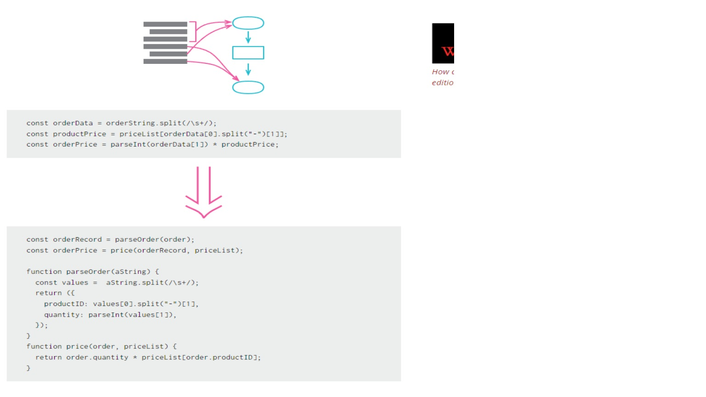
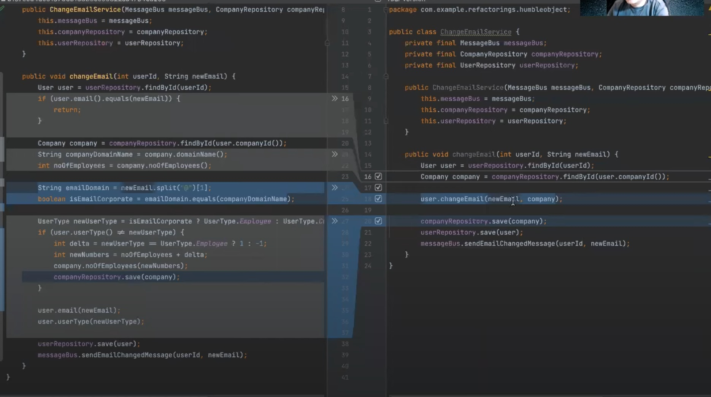

## 머리말

코드를 깔끔하게 만들 수 있는 방법들이다. 다양한 방법들도 있지만, 우선 3가지만 정확히 이해해도 상당히 좋은 코드로 리팩토링이 가능하다.
우선 관련 링크의 내용을 보는 것을 추천한다.

 해당 내용들을 해당 자료들을 나만의 언어로 정리 해둔 문서입니다. 단순히 내용정리를 하는 것이 아니라, 자기 만의 문서로 만들어 보는 것을 추천합니다.

split phase : https://www.youtube.com/watch?v=MfQLk8IL60Y

humble object:https://www.youtube.com/watch?v=JYhTjzp0ChU

functionalCore & Mutable shell: https://www.youtube.com/watch?v=Qr_FxgpMuWA

## Split Phase

출처: https://refactoring.com/catalog/splitPhase.html

해당 그림이 요약이 잘되어있는 편이다. 

플로우를 글로 정리한다면,

1. 같은 로직끼리 묶는다.
2. 메소드를 추출한다.
3. 중간 구조체(객체)를 만든다.
4. 중간 구조체를 추출한 메소드에 파라미터로 넣는다.
5. 메소드 파라미터와 메소드에서 사용했던 파라미터 들을 중간 구조체의 필드로 변경한다.
6. 사용하지 않은 파라미터들을 지운다.

### 느꼈던 점 
리팩토링의 정석에 가까운 느낌을 받았다.
그리고 실전에서 자주 접할 문제라고 생각했다. 
객체의 책임을 잘 분리해주는 느낌을 받았다.

### 아쉬웠던 점

나는 위의 단계에서 하나를 더 추가해도 될것 같았다. 바로, 그 메소드를 중간 객체 안에 넣는 것이다.
그렇게 된다면 조금더 객체 지향적이며, 책임을 정확하게 맡는다. 그리고 유지 보수 하기 좋은 코드가 되지 않을까라는 생각을 해보았다.

## Humble Object Pattern

요약하자면, 비지니스 로직을 순수 객체(Pojo)에 넣는 방식이라고 생각하면 편합니다.

humble의 뜻은 겸손한, 가난한,평범한 입니다. 여기서 humble은 평범한 입니다.
테스트를 하고싶어도 테스트 하기 어려운 객체(특별한 객체)를 테스트할 필요가 없는 객체(평범한 객체)로 만드는 패턴입니다.

출처: 위에서 언급했던 humbleObjectPattern 강의 영상중 일부

왼쪽에 있는 것이 humbleObjectPattern를 적용하기 전이고 오른쪽은 후이다,
오른쪽에서는 Employee와 Company에게 적절한 책임을 주게 변경되었다.
비지니스 로직도 ChangeEmailService이 아닌, 각자 맡은 책임을 얻을 수 있다.

왼쪽의 장점은 비지니스 로직을 한눈에 볼 수 있다. 하지만 단점은 테스트하기 어렵습니다.
테스트를 하기위해서는 테스트 대역을 사용해야 하고, 테스트마다 테스트 대역의 수는 계속 증가 할수 있습니다.
단점이 너무 강력합니다.

오른쪽의 단점은 왼쪽에 비해서 비지니스 로직이 한눈에 안 들어 올 수 있습니다. 하지만, 테스트 하기 쉬운 코드입니다.
테스트를 테스트 대역을 만들 필요없이 단순 객체 테스트를 진행하면 됩니다.

ps. 같이 읽어보면 좋을 자료

계층형 아키택쳐:https://jojoldu.tistory.com/603

## Functional Core & mutableShell
전반적으로, humble Object pattern 과 유사함.

다른 점이라면, Fuctional Core 는 입력 객체가 들어오면, 출력 객체가 나오는 구조로 만든다.
MutableShell에서 db 수정등을 맡긴다. 라고 보면 편하다.
이때, Functional Core가 비즈니스 로직을 담당하고, MutableShell 는 layered 아키택쳐에서 서비스계층이라고 생각하면 편하다.

## 느낀 점

현재 좋다고 평가되는 코드나 일부 코드 리팩토링은 아직까지는 하나의 길로 귀결 되는 것 같다.
도메인 주도 개발이나 객체지향, 일부 코드 리팩토링등 결국 말만 조금씩 다르지. 본질은 객체를 잘 이용하라는 하나의 길을 소개 하는듯 하다.

앞으로가 기대된다. 현재까지 객체지향이나 일부 코드 리팩토링 관련내용들도 객체를 활용하는 방식들이 소개가 된다.
과연, 이것을 바꿀 패러다임이 생길지, 아니면 더 보강이 된 내용들이 나올지 기대된다.

## 함께 읽어보면 좋을 자료
이동욱님-테스트하기 좋은 코드 시리즈: https://jojoldu.tistory.com/681
